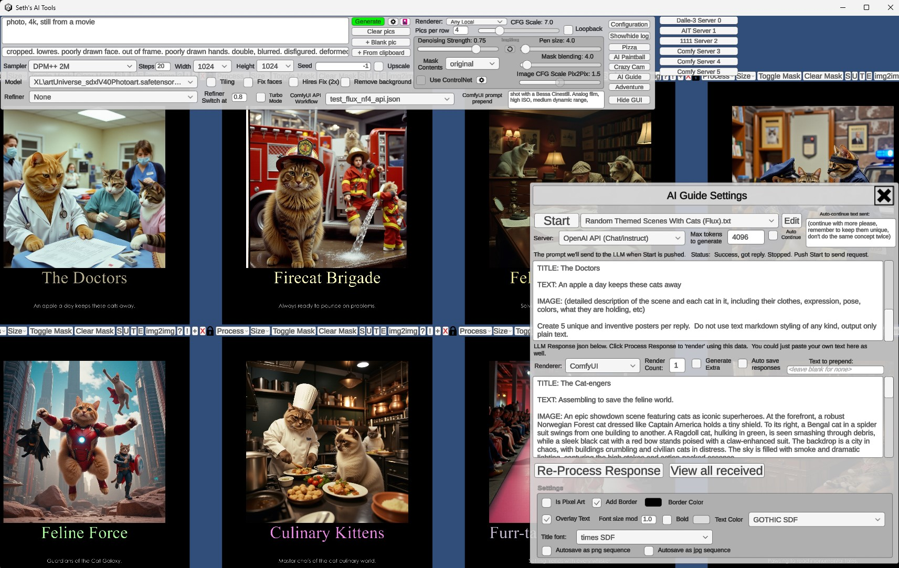
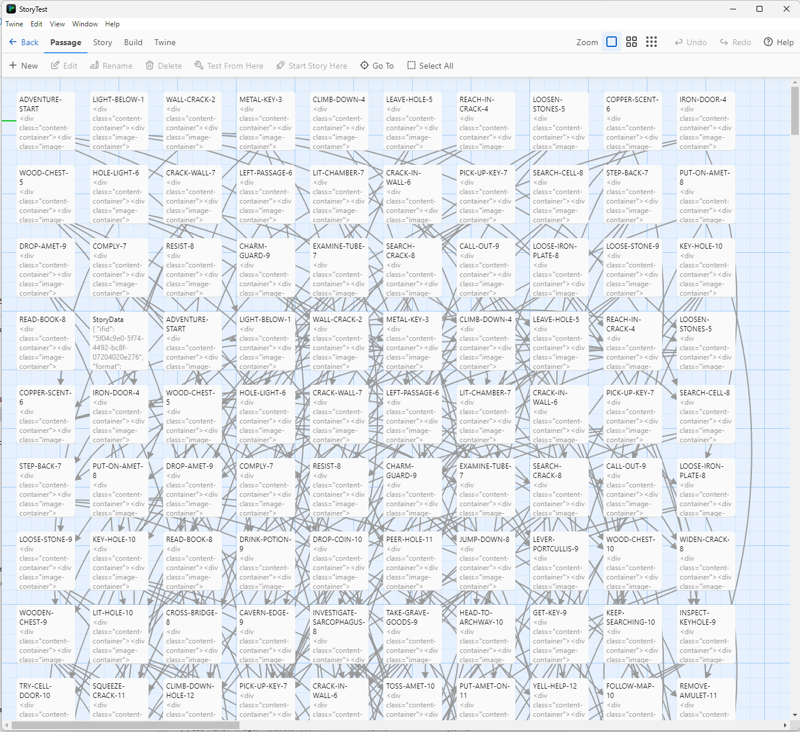
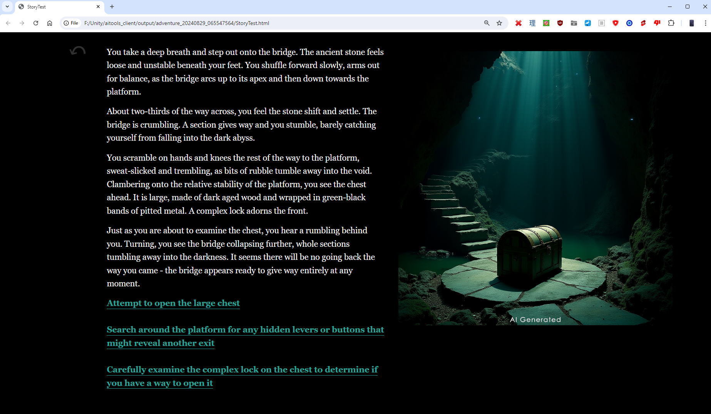
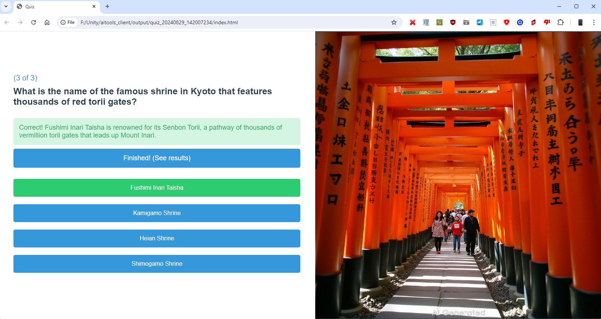
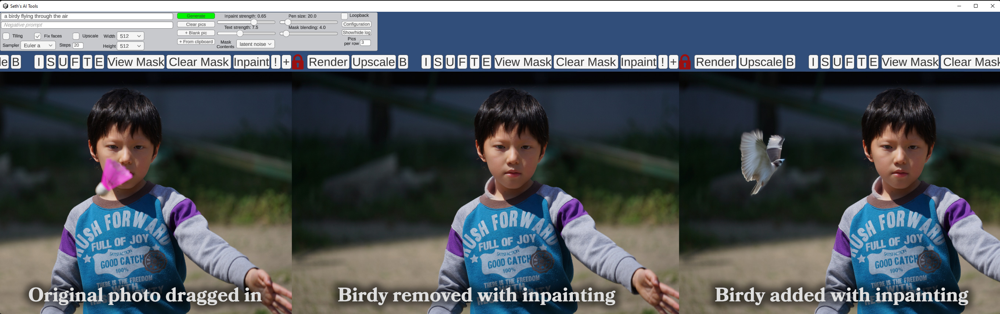
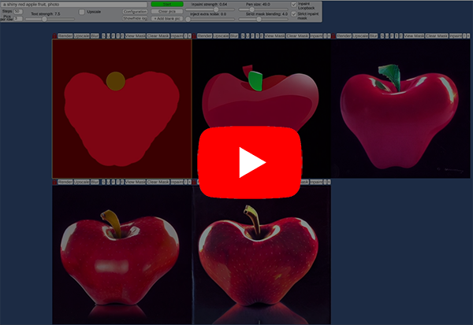
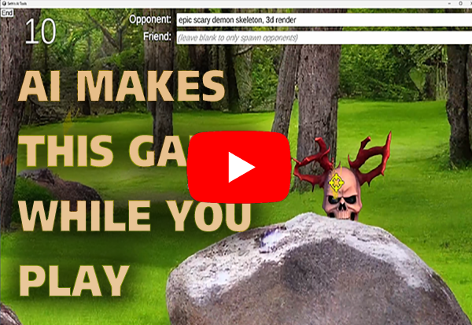
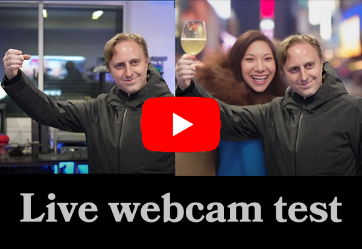
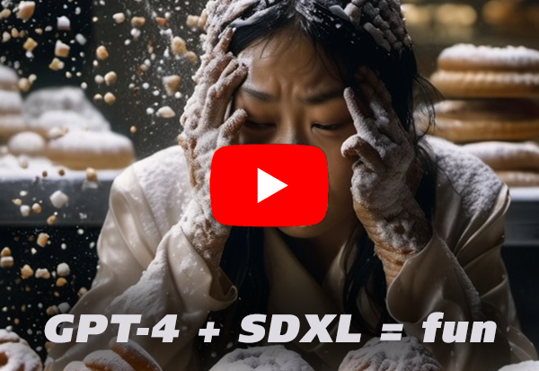

# Seth's AI Tools: A Unity based front-end that talks to various AI APIs to do experimental things like generate Twine games, quizzes, posters and more.

License:  BSD style attribution, see LICENSE.md

<p float="left">
<a href="Media/ai_tools_ai_guide.jpg"></a>
</p>

# Download the latest [AI Tools Client (Windows, 56 MB)](https://www.rtsoft.com/files/SethsAIToolsWindows.zip)

To use this, you'll need to connect to something that can generate images, and hopefully an LLM too.  A single OpenAI key is enough to do a lot, you can also connect A1111 and ComfyUI servers, Text Genersion WebUI and TabbyAPI servers for LLMs.

Note:  Instead of A1111, you can use Seth's modified version that has a few special features:
## [Seth's AI Tools Server](https://github.com/SethRobinson/aitools_server) (Same as below but with a few extra features, including background removal) ##

# Features #

* It's not a web app, it's a native locally run Windows .exe
* Live update integration (image and masking) with Photoshop or other image editors
* text to image, img2img, image interrogation, face fixing, upscaling, tiled texture generation with preview, automasking of subject, background removal
* Drag and drop images in as well as paste images from the windows clipboard
* Built-in image processing like cropping and resizing
* Pan/zoom with thousands of images on the screen
* Mask painting with controllable brush size
* Option to automatically save all generations, with accompanying .txt file that includes all settings
* Supports pix2pix and ControlNet (For ControlNet, the server requires [Mikubill's sd-webui-controlnet extension](https://github.com/Mikubill/sd-webui-controlnet)) and its models to be installed, otherwise the option is grayed out
* Can utilize multiple servers (three video cards on one machine? Run three servers!) allowing seamless use of all GPUs for ultra fast generation and a single click to change the active model
* Neat workflow that allows evolving images with loopback while live-selecting the best alternatives to shape the image in real-time
* Privacy respected - does not phone home or collect any statistics, purely local usage. (it does check a single file on github.com to check for newer versions, but that's it)
* Includes "experiments", little built-in games and apps designed to test using AI/SD for specific things: CrazyCam is a realtime webcam filter with 30+ presets, Shooting Gallery tests realtime craetion of sprites during a game, etc
* AI Guide feature harnesses the power of AI to create motivational posters, illustrated stories or whatever
* Adventure mode has presets to various modes - generate ready to upload illustrated web quiz from prompt, simple Twine game project from a prompt, and "Adventure", a sort of illustrated AI Dungeon type of toy


## Current version: **V0.90** (released Sept 29th 2024) ##

**Recent changes**:

* Big overhaul that allows multiple kinds of renderers and LLMs to be used.
* Added support for ComfyUI as a renderer (I needed this for Flux, A1111 doesn't/didn't support it) (Flux is AWESOME!)
* Added support for Anthropic as a LLM
* AI Guide has lots of changes, only Chat style AI is supported now, I deleted all the old presets.  Works well with Mistal Large and Llama 3.1
* NEW: Adventure mode! Has presets to various modes - generate ready to upload illustrated web quiz from prompt, simple Twine game project from a prompt, and "Adventure", a sort of illustrated AI Dungeon type of toy
* AI Guide and Adventure have .txt files to control presets, you can copy and edit these as needed to create your own presets
* A lot of the image editings and image to image stuff I haven't been using lately, so beware it may be broken, it only works with A1111 based renderers anyway
* You can now set an authentication key in config.txt for Text Generation WebUI/TabbyAPI LLM servers
* Lots of little tweaks and improvements to the GUI
* It's now possible to choose OpenAI for everything and use AI Guide and Adventure mode with only an OpenAI API key and setting nothing else up.  You can also mix and match, for example, use OpenAI or Anthropic for text generation, but your own A1111 and/or ComfyUI servers for the imagery. Or your own local LLM for text and... etc.
* Everything it generates now goes into the "output" subfolder
* AI Guide and Adventure presets will add "AI Generated" at the bottom of the image by default.  You can edit the presets to change/remove that label, but I figure it's useful for both humans and bot scapers of the future


You only need to download [the zip](https://www.rtsoft.com/files/SethsAIToolsWindows.zip) and run the .exe to use this, However, the source might be useful to generate a build for other platforms, fork or steal pieces to use for yourself.  Go ahead!
# Screenshots

<a href="Media/ai_tools_dungeons_generate.png"></a>
<a href="Media/ait_dungeon_twine_export.png"></a>
<a href="Media/ait_twine_stored_html2.png"></a>
<a href="Media/ait_quiz_kyoto.png"></a>
<a href="Media/ai_tools_birdy_to_bird.jpg"></a>

# Media (outdated videos of the app) #

<a href="https://www.youtube.com/watch?v=2TB4f8ojKYo"></a>
<a href="https://www.youtube.com/watch?v=3PmZ_9QfrE0"></a>
<a href="https://www.youtube.com/watch?v=FoYY_90KlyE"></a>
<a href="https://www.youtube.com/watch?v=VKj-x25-04E"></a>
<a href="https://www.youtube.com/watch?v=YQMWflU1v-U"></a>

# Setup #

If using AUTOMATIC1111's Stable Diffusion WebUI, make sure it has been started with the --api parm.  (additionally, with the --listen parm if it isn't on the local machine)

On Windows, an easy way to do that is to edit webui-user.bat and add them after the "set COMMANDLINE_ARGS=" part.  Start the server by double clicking webui-user.bat.

Next run aitools_client.exe.  Click on the "Configuration" button and a text editor will open with the default settings:

```bash
#add as many add_server commands as you want, just replace the localhost:7860 part with the
#server name/ip and port.  You can control any number of renderer servers at the same time.

#Supported server types:  Seth's AI Tools, A1111, ComfyUI supported.  For Dalle-3, don't set here, just enter your OpenAI key below.

#Uncomment below and put your renderer server.  Add more add_server commands to add as many as you want.
#add_server|http://localhost:7860

#Set the below path and .exe to an image editor to use the Edit option. Changed files will auto
#update in here.

set_image_editor|C:\Program Files\Adobe\Adobe Photoshop 2024\Photoshop.exe

#set_default_sampler|DDIM
#set_default_steps|50

#To generate text with the AI Guide features, you need at least one LLM. (or all, you can switch between them in the app)

#OPENAI (works for LLM and Dalle-3 as renderer)
set_openai_gpt4_key|<key goes here>|
set_openai_gpt4_model|gpt-4o|
set_openai_gpt4_endpoint|https://api.openai.com/v1/chat/completions|

#address of your generic LLM to use, can be local, on your LAN, remote, etc (text-generation-webui or TabbyAPI API format)
set_generic_llm_address|localhost:5000|
#if your generic LLM needs a key, enter it here (or leave as "none")
set_generic_llm_api_key|none|
            
#Anthropic LLM
set_anthropic_ai_key|<key goes here>|
set_anthropic_ai_model|claude-3-5-sonnet-20240620|
set_anthropic_ai_endpoint|https://api.anthropic.com/v1/messages|
set_anthropic_ai_version|2023-06-01|

```

# Building from source

* Requires Unity 2022.3.22+
* Open the scene "Main" and click play to run
* Assets/GUI/GOTHIC.TFF and Assets/GUI/times.ttf are not included and might break the build because I was having trouble and switched some settings around that might require them now (dynamic vs static TMPro font settings...)

---

Credits and links

- Audio: "Chee Zee Jungle"
Kevin MacLeod (incompetech.com)
Licensed under Creative Commons: By Attribution 3.0
http://creativecommons.org/licenses/by/3.0/
- NotoSansCJKjp-VF font licensed under the Open Font License (OFL)
- Audio: JOHN_MICHEL_CELLO-BACH_AVE_MARIA.mp3 performed by John Michel. Licensed under Creative Commons: By Attribution 3.0
http://creativecommons.org/licenses/by/3.0/

- Written by Seth A. Robinson (seth@rtsoft.com) twitter: @rtsoft - [Codedojo](https://www.codedojo.com), Seth's blog
- Special thanks to the awesome people working on AUTOMATIC1111's [stable-diffusion-webui](https://github.com/AUTOMATIC1111/stable-diffusion-webui) project