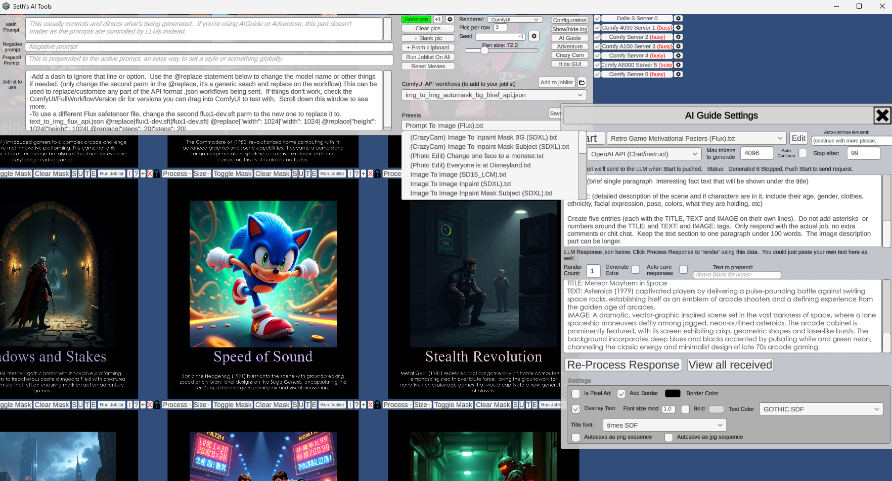

# Seth's AI Tools: A Unity based front-end for ComfyUI and Ollama (and others) that does things like generate photos and movies, Twine games, quizzes, posters and more.

License:  BSD style attribution, see LICENSE.md

<p float="left">
<a href="Media/aitools_v2_aiguide.png"></a>
</p>


## August 7th 2025: For now, this project is no longer being publicly updated.  Workflows I created only months ago are breaking due to the constant changes in ComfyUI, its plugins, the models, etc.  As a result, only the workflows that I personally need at the moment are likely to be working right.  

## The effort required to make this project stable and useful for anyone but me has reached a high enough level that it just doesn't make sense to bother updating here anymore.

## Download the latest (last?) public version: V2.01 (Aug 7th, 2025) [AI Tools Client (Windows, 62 MB)](https://www.rtsoft.com/files/SethsAIToolsWindows.zip)

Need an old version? The last pre-V2 version (that still supports Auto1111) can be downloaded [here](https://www.rtsoft.com/files/SethsAIToolsWindowsV095.zip).

To use this, you'll need to connect to something that can generate images, and hopefully an LLM too.  A single OpenAI key is enough to do a lot (LLM and Dale3 rendering), you can also use Claude (via API key), or best yet, your own local ComfyUI server(s) and Ollama.

## Features

- It's not a web app, it's a native locally run Windows .exe
- It's kind of like lego, is can run ComfyUI workflows that chain together.  You need to understand ComyUI and workflow tweaking as you'll still need to install all the needed custom nodes and models there. (you do have ComfyUI Manager installed, right?!)
- Drag and drop images in as well as paste images from the windows clipboard
- Built-in image processing like cropping and resizing, mask painting
- Pan/zoom with thousands of images on the screen
- Built to utilize many ComfyUI servers at once
- Privacy respected - does not phone home or collect any statistics, purely local usage. (it does check a single file on github.com to check for newer versions, but that's it)
- Includes "experiments", little built-in games and apps designed to test AI
- AI Guide feature harnesses the power of AI to create motivational posters, illustrated stories or whatever
- Adventure mode has presets to various modes - generate ready to upload illustrated web quiz from prompt, simple Twine game project from a prompt, and "Adventure", a sort of illustrated AI Dungeon type of toy
- Includes presets and workflows for Flux, SDXL, Hunyuan, Wan 2.1, MMAudio, SAM2, BiRef
- By default strips<think> tags when continuing LLM work for Deepseek/thinking models
- For developers, using Unity and C# to do powerful things with AI instead of banging your head against the wall with ComfyUI workflows and python is pretty sweet
- You can drag in a bunch of pictures and have it turn them into tiny movies with sound.  How cool is that?

## Recent changes

- Presets have new features to make them more like scripts, for example, you can now invoke the LLM to change/write text, resize images, copy the prompt text to the audio prompt text, stuff like that.  Nothing is documented and it's complicated to use
- Adventure mode has a button that takes the active story and dynamically uses the active LLM to create an image prompt.  (AutoPic.txt is the script that the button runs)
- New ComfyUI workflows were added for Kontext and Wan 2.2, I'm sure they are already out of date
- This will probably be the last public update, it's just too hard to keep everything running for general use

## Known issues

- I suspect certain workflows won't work on Windows because I have a subdir in the model filename and the whole "/" vs "\\" thing rears its ugly head.  Why wouldn't ComfyUI fix those based on the system it's running on?  Anyway, you can either use a @replace to fix them in AITools, or edit the workflow's .json with a text editor, or drag the workflow into ComfyUI and edit the path there.  I only test on Windows, with the servers running on Ubuntu.
- Lack of documentation etc due to laziness
- CrazyCam (where the webcam is being used for realtime image processing) is half broken and slow
- Expect things to break and change, it's very alpha and probably always will be
- Probably a ton of bugs, I haven't tested it much
- The SDXL Inpainting ComfyUI workflow sometimes fails, tweaking the alpha mask fixes it, no idea what's up but it's not happening on my app's side
- The SAM2 based "select things by name" segmentation is pretty sketch, best I could find though.  Also, it can only select ONE thing in the image, I don't see a way to fix it without writing a custom node.  Use the including BiRef workflow instead if you can, it can only do "foreground" and "background" but it works much better in general.
- It can use all of OpenAI's APIs unless you set it to o1-mini, OpenAI doesn't like the format and gives an error.  gpt-4o and o3-mini work fine so whatever I guess.


You only need to download [the zip](https://www.rtsoft.com/files/SethsAIToolsWindows.zip) and run the .exe to use this, However, the source might be useful to generate a build for other platforms, fork or steal pieces to use for yourself.  Go ahead!

# Screenshots

<a href="Media/ai_tools_dungeons_generate.png"></a>
<a href="Media/ait_dungeon_twine_export.png"></a>
<a href="Media/ait_twine_stored_html2.png"></a>
<a href="Media/ait_quiz_kyoto.png"></a>
<a href="Media/ai_tools_birdy_to_bird.jpg"></a>

# Media (mostly outdated videos of the app) #

<a href="https://www.youtube.com/watch?v=2TB4f8ojKYo"></a>
<a href="https://www.youtube.com/watch?v=3PmZ_9QfrE0"></a>
<a href="https://www.youtube.com/watch?v=FoYY_90KlyE"></a>
<a href="https://www.youtube.com/watch?v=VKj-x25-04E"></a>
<a href="https://www.youtube.com/watch?v=YQMWflU1v-U"></a>
# Setup #

Your ComfyUI server needs to be started using the --listen parm, so the API can be accessed.  

After running it, a config.txt will be made. There is an config edit button inside the app, your config will look like this:

```
#add as many add_server commands as you want, just replace the localhost:7860 part with the
#server name/ip and port.  You can control any number of renderer servers at the same time.

#This is where you add rendering servers. (ComfyUI servers run with --listen parm)  For Dalle-3, don't set here, just enter your OpenAI key below.

#Uncomment below and put your renderer server.  Add more add_server commands to add as many as you want.  The second parm is
#an optional name so you can keep track of which server has which video card.
#add_server|http://localhost:7860|5090!|

#Set the below path and .exe to an image editor to use the Edit option. Changed files will auto
#update in here.

set_image_editor|C:\Program Files\Adobe\Adobe Photoshop 2025\Photoshop.exe

#To generate text with the AI Guide features, you need at least one LLM. (or all, you can switch between them in the app)

#OPENAI (works for LLM and Dalle-3 as renderer)
set_openai_gpt4_key|<key goes here>|
set_openai_gpt4_model|gpt-4o|
set_openai_gpt4_endpoint|https://api.openai.com/v1/chat/completions|

#address of your generic LLM to use, can be local, on your LAN, remote, etc (text-generation-webui or TabbyAPI API format)
set_generic_llm_address|localhost:5000|
#if your generic LLM needs a key, enter it here (or leave as "none")
set_generic_llm_api_key|none|

#what we tell the model to use. If you notice the llm is forgetting things or messing up, your model might not be an instruct-compatible model, try llama 3.3 with Ollama as a test.
set_generic_llm_mode|chat-instruct|

#this is needed if using an ollama server, otherwise you'll see a "model is required" error.  Note that might cause the model to be loaded which means a huge delay at first.
add_generic_llm_parm|model|"llama3.3"|#needed for ollama, the model you want to use
#add_generic_llm_parm|num_ctx|131072|#needed for ollama, the context size you want the model to load with (we'll create a custom profile with an _ait extension)
#add_generic_llm_parm|temperature|1.0|#allows you to globally override LLM temperatures
#add_generic_llm_parm|max_tokens|4096|

# Ollama optimization settings (new in v2.01)
#add_generic_llm_parm|use_ollama_defaults|true|#skip creating custom profile and use Ollama's optimized defaults
#add_generic_llm_parm|skip_ait_suffix|true|#don't append _ait to model names, use original model directly

#some things you could play with
#add_generic_llm_parm|stop|["<`eot_id`>", "<`eom_id`>", "<`end_header_id`>"]|#Note that ` gets turned into |
#add_generic_llm_parm|stopping_strings|["<`eot_id`>", "<`eom_id`>", "<`end_header_id`>"]|

#the following allow you to override the default system, assistant, and user keywords for the generic LLM, if needed.  
#different LLMs are trained on different words, if the llm server you use doesn't hide this from you, you might notice weird
#or buggy behavior if these aren't changed to match what that specific llm wants
#set_generic_llm_system_keyword|system|#default is system
#set_generic_llm_assistant_keyword|assistant|#default is assistant
#set_generic_llm_user_keyword|user|#default is user
      
#Anthropic LLM
set_anthropic_ai_key|<key goes here>|
set_anthropic_ai_model|claude-3-7-sonnet-latest|
set_anthropic_ai_endpoint|https://api.anthropic.com/v1/messages|

#if you're using a ComfyUI workflow that creates audio, and you don't have AITOOLS_AUDIO_PROMPT or AITOOLS_AUDIO_NEGATIVE_PROMPT set in the ComfyUI workflow, these are used as defaults:
set_default_audio_prompt|audio that perfectly matches the onscreen action|
set_default_audio_negative_prompt|music|
```


# Setting up with ComfyUI (for FLUX images, Wan 2.1, Hunyuan video or any custom workflow)

First, install [ComfyUI](https://github.com/comfyanonymous/ComfyUI) and get it rendering stuff in Flux and/or Hunyuan using tutorials out there.

**Don't move on until it's working and you can generate images (Flux is good) and/or videos in ComfyUI directly**!

Next, just for a test to make sure the workflows included with AITools are going to work, inside ComfyUI's web GUI, drag in aitools_client/ComfyUI/FullWorkflowVersions/text_to_img_flux.json or any others.  The neat thing about ComfyUI is it will read this and convert it to its visual workflow format, ready to run.  (you might want to change the prompt from <AITOOLS_PROMPT> to something else during testing here) - Click Queue.  Does it work?  Oh, if you see an Image Loader set to the file "<AITOOLS_INPUT_1>" you'll need to change that to a file on your ComfyUI server if you want to test.

You'll probably see a bunch of red nodes and errors - no problem!  Make sure you have ComfyUI-Manager installed, you can use it to install any missing nodes.  You'll probably have to track down various model files though, but at least when you try to render it will shows exactly the filenames that are missing. (look for red boxes around certain nodes)

Adjust it until it works (change paths or models or whatever you need, you could even start with a totally different workflow you found somewhere else), and make sure the prompt is set to <AITOOLS_PROMPT>.  (<AITOOLS_NEGATIVE_PROMPT> can be used if your workflow has a place for that too)  Then do Workflow->Export (API) if you wanted to save your own.  Note:  **You need to have enabled "Dev mode" in the ComfyUI settings to see the "Export (API)" option.**

So you don't have to create custom workflows for every checkpoint/filesize etc, you can use AITools' "@replace" to change any part of a workflow before it's sent to ComfyUI's API.  You'll see it used in various presets.

Check discussions for some more info [here](https://github.com/SethRobinson/aitools_client/discussions/18)

# Building from source

- Requires Unity 6+
- Open the scene "Main" and click play to run
- Assets/GUI/GOTHIC.TFF and Assets/GUI/times.ttf are not included and might break the build because I was having trouble and switched some settings around that might require them now (dynamic vs static TMPro font settings...)

---

Credits and links

- Audio: "Chee Zee Jungle"

Kevin MacLeod (incompetech.com)

Licensed under Creative Commons: By Attribution 3.0

http://creativecommons.org/licenses/by/3.0/

- NotoSansCJKjp-VF font licensed under the Open Font License (OFL)
- Audio: JOHN_MICHEL_CELLO-BACH_AVE_MARIA.mp3 performed by John Michel. Licensed under Creative Commons: By Attribution 3.0

http://creativecommons.org/licenses/by/3.0/

- Written by Seth A. Robinson (seth@rtsoft.com) twitter: @rtsoft - [Codedojo](https://www.codedojo.com), Seth's blog
- Special thanks to the awesome people working on AUTOMATIC1111's [stable-diffusion-webui](https://github.com/AUTOMATIC1111/stable-diffusion-webui) project
