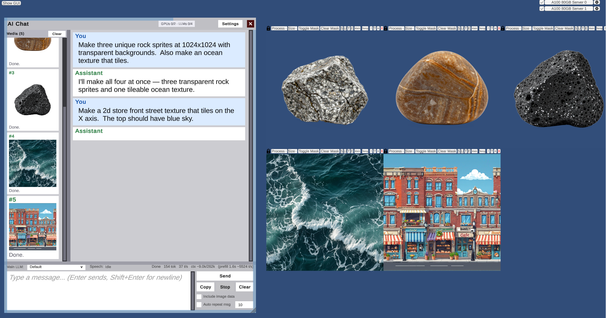
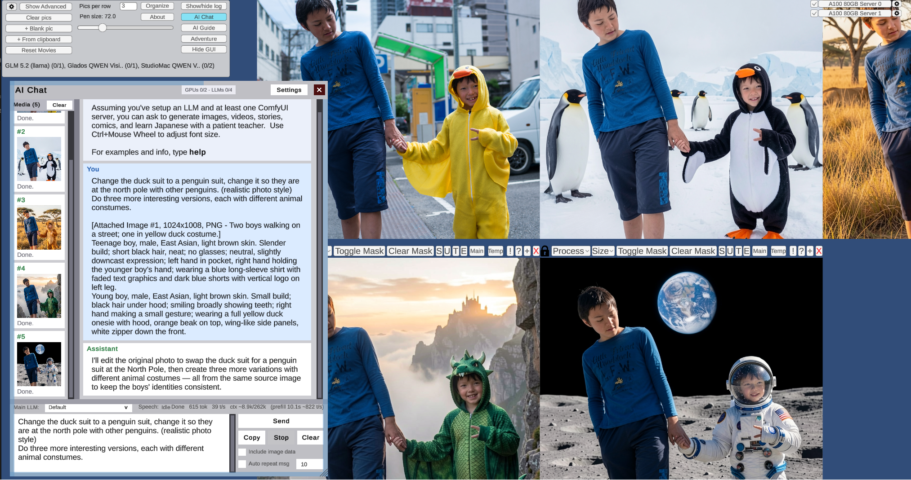
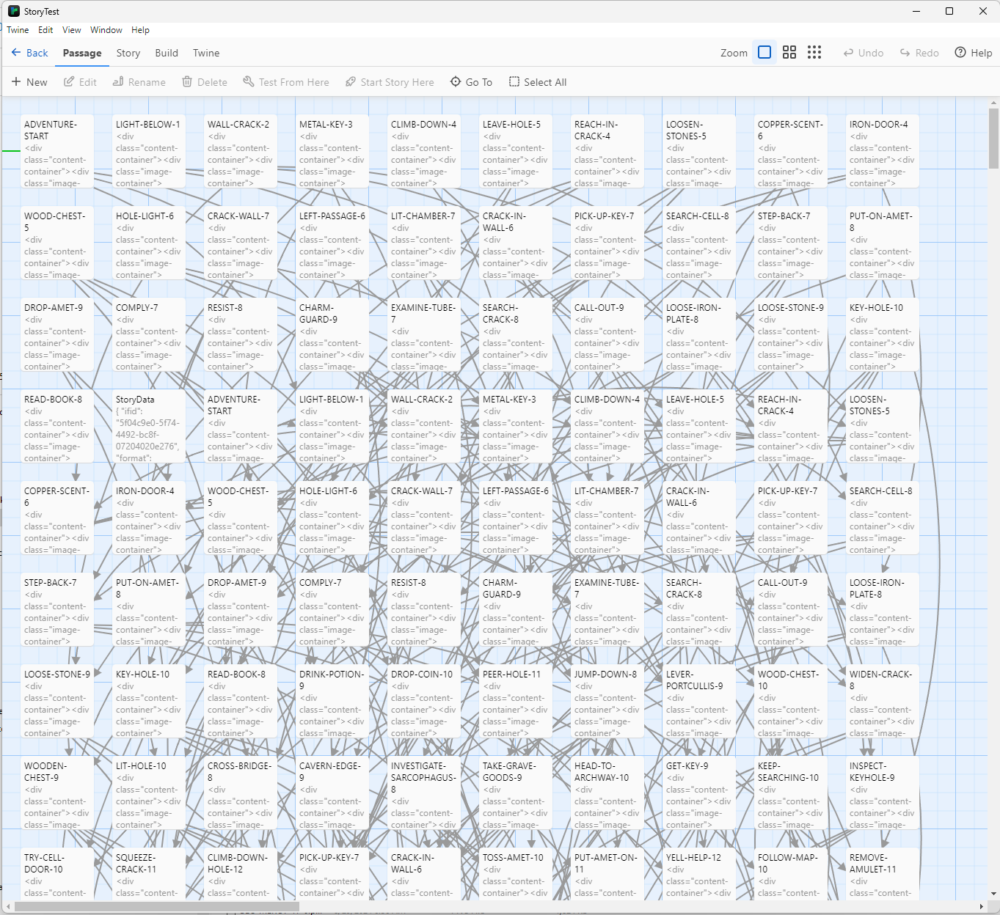
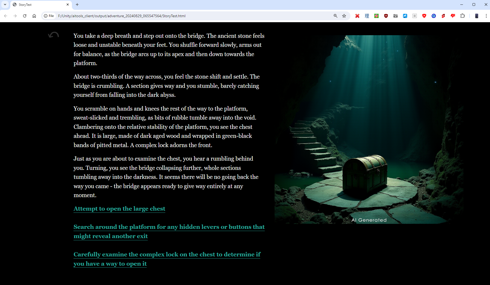
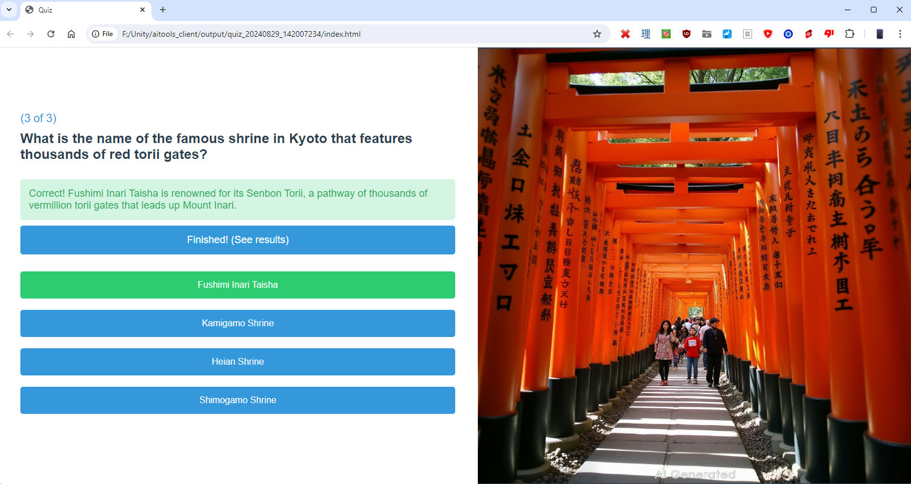
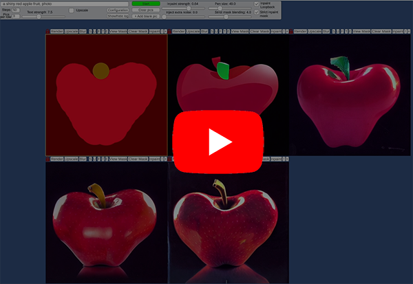
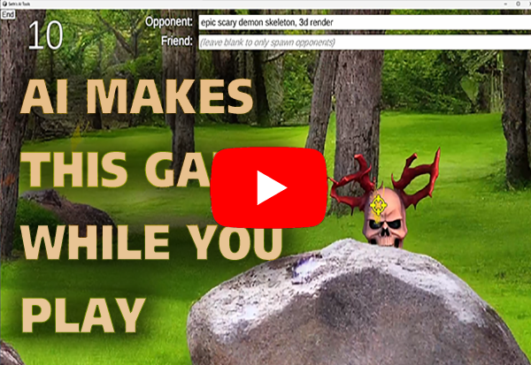
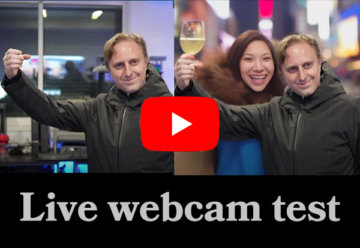

# Seth's AI Tools: A Unity based front-end that uses ComfyUI and LLMs to do story and image/movie stuff

License:  BSD style attribution, see LICENSE.md

# Download

Download the latest: V3.03 (Jul 3rd, 2026) [AI Tools Client (Windows, 139 MB)](https://www.rtsoft.com/files/SethsAIToolsWindows.zip) (codesigned by me)

## Features

- It's not a web app, it's a native locally run Windows .exe (Unity with C#)
- AI Chat mode is kind of like chatgpt/nanobanana, can just "ask" it to make images, posters, intelligently use anchor images, etc
- Built-in image processing like cropping and resizing, mask painting
- Pan/zoom with thousands of images on the screen
- Built to utilize many ComfyUI servers and LLMs at once
- AI Guide feature harnesses the power of AI to create motivational posters, illustrated stories 
- Adventure mode allows playing a realtime illustrated adventure (kind of like AI Dungeon) or generate quizes and choose your own adventures that can be exported to self contained playable HTML versions
- I've been using this as a personal AI testbed and tool/toy for OVER THREE years, weird experimental things are added and removed kind of randomly
- Privacy respected - does not phone home or collect any statistics, purely local usage. (it does check a single file on github.com to check for newer versions, but that's it)

## Recent changes

### V3.03 (Jul 3rd, 2026)

* Added AI Chat video import/clipping with FFmpeg-backed transcodes, long-clip selection, preview proxies, audio controls, and still-frame import
* Added Bernini-R image editing/video-to-video presets and a separate RIFE video interpolation utility
* Improved video workflow reliability with MOV/HEVC processing proxies, source-duration Bernini frame caps, and unique ComfyUI output names for LTX renders
* Improved AI Chat attachment drops and fixed EXIF orientation on imported images
* Fixed Generate button and Unity 6000.5 build/editor issues
* Bundled FFmpeg/ffprobe helpers and licenses for video processing

### V3.02 (Jun 29th, 2026)

* AI Chat now surfaces LLM/backend errors as visible bubbles instead of failing silently
* Added Opus 4.8, refreshed the Gemini model list
* AI Chat input box: draggable resize divider, scroll bar, and command-line style prompt history
* Stronger anchoring and multi-step "continue" handling so the model can carry out longer plans
* Comic creation now defaults to Ideogram 4, plus improved prompt caching
* Krea 2 Turbo image generation, AI Chat help system, background-removal and tiling skills
* Highlight words in AI Chat and have them spoken via ElevenLabs (add an API key)
* Force GPU reset option for reconnect, copy images to the Windows clipboard

### V3.01 (Jun 21st, 2026)

* Tons of work done on the AI Chat feature as that's kind of all you need now
* New splash/startup screen
* Lot of tweaks and bug fixes, Ideogram 4 support added (AI Chat can directly write its json image description format for pretty good results)

## Known issues

- CrazyCam broken/disabled
- Things tend to get broken if I haven't used that particular feature in a while.  It's probably the app, not you

# Screenshots

<a href="Media/aitools_ai_generate_example.png"></a>
<a href="Media/aitools_ai_edit_example.png"></a>

<a href="Media/ai_tools_dungeons_generate.png"></a>
<a href="Media/ait_dungeon_twine_export.png"></a>
<a href="Media/ait_twine_stored_html2.png"></a>
<a href="Media/ait_quiz_kyoto.png"></a>

# Media (mostly old outdated videos of the app of features that don't even exist anymore, but hey) #

<a href="https://www.youtube.com/watch?v=2TB4f8ojKYo"></a>
<a href="https://www.youtube.com/watch?v=3PmZ_9QfrE0"></a>
<a href="https://www.youtube.com/watch?v=FoYY_90KlyE"></a>
<a href="https://www.youtube.com/watch?v=VKj-x25-04E"></a>
<a href="https://www.youtube.com/watch?v=YQMWflU1v-U"></a>
# Setup #

Your ComfyUI server needs to be started using the --listen parm, so the API can be accessed.

After running it, a config.txt will be made. There is a config edit button inside the app, it's kind of self-documented, just go through it and update as necessary.

If your ComfyUI server is password protected, for example with the [ComfyUI-Login](https://github.com/liusida/ComfyUI-Login) custom node, append its direct API bearer token to the `add_server` line:

```txt
add_server|http://secured-box.lan:8188|token=$2b$12$qUfJfV942n...
```

This is optional; leave `|token=...` off for normal open ComfyUI servers. For ComfyUI-Login, use the token it prints for direct API calls, not your web UI password. AITools sends it as an `Authorization: Bearer` header for ComfyUI HTTP and WebSocket requests.

# Setting up with ComfyUI

**Tip:** modern AI assistants (Claude, ChatGPT, etc.) can read this README and figure out how to download, install, and test the workflows AI Tools needs to run. I actually recommend doing it that way - just point your AI at this page and let it walk you through (or do) the setup, it saves a lot of time.

First, install [ComfyUI](https://github.com/comfyanonymous/ComfyUI) and get it rendering stuff.

Then install my [Workflow to API Converter Endpoint](https://github.com/SethRobinson/comfyui-workflow-to-api-converter-endpoint) via ComfyUI Manager

This node allows us to only work with normal workflow json files, and never have to export "API" versions.  The API conversions will happen under the hood automatically when needed, makes life much better.  Click its page above for help.

It will work if you don't, but this allows modified or new workflows to work as it can convert them to "API" versions on the fly when needed.

Next, just for a test to make sure the workflows included with AITools are going to work, inside ComfyUI's web GUI, drag in aitools_client/ComfyUI/FullWorkflowVersions/text_to_img_flux.json or any others.  The neat thing about ComfyUI is it will read this and convert it to its visual workflow format, ready to run.  (you might want to change the prompt from <AITOOLS_PROMPT> to something else during testing here) - Click Queue.  Does it work?  Oh, if you see an Image Loader set to the file "<AITOOLS_INPUT_1>" you'll need to change that to a file on your ComfyUI server if you want to test.

You'll probably see a bunch of red nodes and errors - no problem!  Make sure you have ComfyUI-Manager installed, you can use it to install any missing nodes.  You'll probably have to track down various model files though, but at least when you try to render it will shows exactly the filenames that are missing. (look for red boxes around certain nodes)

Adjust it until it works (change paths or models or whatever you need, you could even start with a totally different workflow you found somewhere else), and make sure the prompt is set to <AITOOLS_PROMPT>.  (<AITOOLS_NEGATIVE_PROMPT> can be used if your workflow has a place for that too)  Then do Workflow->Export if you wanted to save your own. (note: we no longer use "API" versions at all, thank god, just normal workflows and dynamically convert them as needed)

So you don't have to create custom workflows for every checkpoint/filesize etc, you can use AITools' "@replace" to change any part of a workflow before it's sent to ComfyUI's API. You'll see it used in various presets.

Check discussions for some more info [here](https://github.com/SethRobinson/aitools_client/discussions/18)

# Command-line tool (Windows & Linux)

A small Python CLI in `cli/` lets you generate images straight from a terminal, pointed at the same ComfyUI servers and `Presets/` as the app. Great for scripting or for AI agents.

On Windows (the `.bat` auto-creates a venv and installs dependencies on first run):

```bat
cli\aitools_cli.bat "a cat playing a guitar" out.png -p "Prompt To Image (Z-Image)"
cli\aitools_cli.bat "make the sky red" out.png -p "Image To Image Klein Edit 1 Input" -i input.png
```

On Linux/macOS:

```bash
python cli/aitools_cli.py "a cat playing a guitar" out.png -p "Prompt To Image (Z-Image)"
```

`-p` picks a preset (any text-to-image or single-step image-to-image preset works; pass an input image with `-i`). Add `-v` for verbose output. It reads `cli/config.txt` for server settings - see `cli/README.md` for details.

# The coolest feature

AI Chat is a feature is kind of "but we have chatgpt image stuff at home" that allows an LLM to basically do everything - try things like "Make a funny motivational poster about the commodore 64", or attach three images of people and say "dress these three people like the 3 stooges".  It will automatically use zimage, Klein based image to image, LTX, etc as needed to perform whatever actions you want.  You can also drop `.mov`, `.mp4`, or `.avi` videos into AI Chat and use short imported clips for video-to-video edits.

It can intelligently create and use 'anchor images' as needed to provide consistency across multiple images, for example if you ask it to "make a comic book about my dog and cat" it can create an anchor image of the dog and cat and reuse that across panels to keep them looking the same. 

It has an automatic "skills" system (it loads them as needed by itself) so it knows how to do things like create illustrated storybooks, comic books, etc.

An LLM as smart as Qwen 3.6 27B or better recommended, in addition to at least one ComfyUI server setup.

# Building from source

You only need to download [the zip](https://www.rtsoft.com/files/SethsAIToolsWindows.zip) and run the .exe to use this, However, the source might be useful to generate a build for other platforms, fork or steal pieces to use for yourself.  Go ahead!

- Requires Unity 6.4+
- Open the scene "Main" and click play to run
- Assets/GUI/GOTHIC.TFF and Assets/GUI/times.ttf are not included and might break the build because I was having trouble and switched some settings around that might require them now (dynamic vs static TMPro font settings...)

---

Credits and links

- Audio: "Chee Zee Jungle"

Kevin MacLeod (incompetech.com)

Licensed under Creative Commons: By Attribution 3.0

http://creativecommons.org/licenses/by/3.0/

- NotoSansCJKjp-VF font licensed under the Open Font License (OFL)
- Audio: JOHN_MICHEL_CELLO-BACH_AVE_MARIA.mp3 performed by John Michel. Licensed under Creative Commons: By Attribution 3.0

http://creativecommons.org/licenses/by/3.0/

- Written by Seth A. Robinson (seth@rtsoft.com) twitter: @rtsoft - [Codedojo](https://www.codedojo.com), Seth's blog
- Special thanks to the [ComfyUI](https://github.com/comfyanonymous/ComfyUI) and [llama.cpp](https://github.com/ggml-org/llama.cpp) projects
